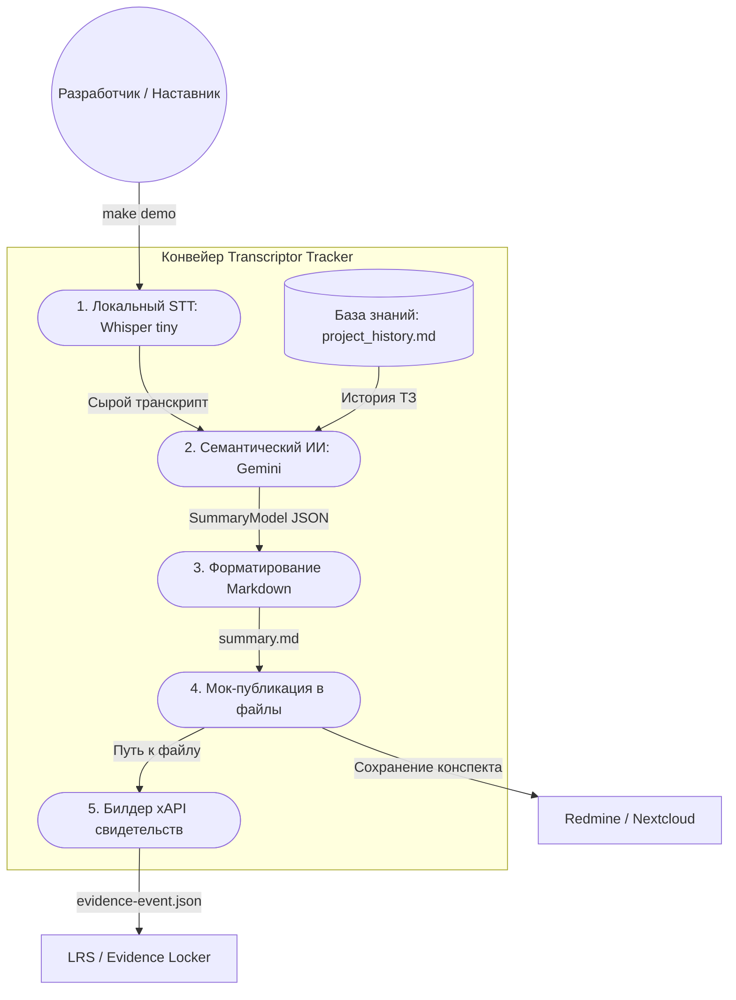

# Модуль Transcriptor-Tracker (MVP)

Инструмент автоматической фиксации устных проектных договоренностей и выявления логических противоречий на основе «проектной памяти».

---

## 1. Решаемая проблема (Бизнес-контекст)

В учебных и проектных командах значительная часть ключевых решений, изменений требований и распределения задач происходит устно — на коротких созвонах, консультациях с куратором или stand-up встречах. 

### Как процесс выглядит без нашего модуля:
Команда проводит обсуждение. Часть договоренностей остается только в памяти людей, часть фиксируется неполно или теряется в разрозненных сообщениях. В результате:
* Теряются технические требования и договоренности.
* Возникают конфликты из-за разного понимания задач участниками.
* Наставникам и кураторам сложно отследить реальный прогресс проекта и логику принятия решений.

### Как процесс выглядит с нашим модулем:
Аудиозапись устного созвона автоматически обрабатывается системой. Модуль переводит речь в текст, анализирует содержание, сопоставляет его с накопленной историей требований (базой знаний проекта), находит расхождения и формирует структурированный конспект для публикации в трекер задач.

---

## 2. Главная гипотеза проекта

> **Если команде достаточно просто сохранить аудиозапись обсуждения в общее пространство, а система автоматически подготовит структурированный конспект, выявит противоречия со старыми требованиями и сформирует xAPI-свидетельства для наставника, то количество потерянных устных договоренностей уменьшится, а проектные решения будут фиксироваться своевременно и без административной рутины.**

---

## 3. Архитектура и сценарий использования (Use-Case)

Система построена на принципах слабой связанности (паттерн **Адаптер**), что позволяет заменять любые технические компоненты (локальный Whisper на облачный API, Gemini на YandexGPT, локальное сохранение на публикацию по API в Redmine) без изменения бизнес-логики.

### Схема сквозного процесса (E2E Workflow):



---

## 4. Демонстрация работы (Проверка гипотезы)

Для подтверждения работоспособности MVP и проверки гипотезы в репозиторий заложена реальная запись 5-минутной консультации студентов с куратором (`consultation_demo.mp3`), на которой обсуждаются требования к отчетности и архитектуре.

В качестве «Базы знаний» (проектной памяти) используется исходный файл ТЗ (`project_history.md`), содержащий первоначальные планы студентов (делать базу данных, вставлять код в отчеты, работать без API).

### Быстрый запуск демонстрации:

Убедитесь, что у вас настроен локальный файл `.env` с ключом:
```text
GEMINI_API_KEY=your_gemini_api_key_here
```

Запустите демонстрационный конвейер одной командой:
```bash
make demo
```

### Результат работы системы (Выявление противоречий в реальном времени):

Система автоматически расшифрует аудиозапись, сопоставит её с историей требований в `project_history.md` и выведет в консоль следующий структурированный конспект:

* **Контекст созвона:** Обсуждение архитектуры MVP, необходимости ведения истории встреч для выявления противоречий и перехода на использование API реальной LLM.
* **Принятые решения:** Использовать внешнее API реальной LLM-модели; сохранять и использовать историю прошлых обсуждений для выявления расхождений.
* **Выявленные противоречия / конфликты (Автоматический анализ ИИ):**
  1. *Конфликт требований к БД:* В истории проекта (ТЗ) указано, что база данных на первом этапе не обязательна, однако для выявления расхождений с прошлыми встречами требуется механизм хранения истории обсуждений.
  2. *Конфликт требований к моделям:* В истории проекта допускался запуск с использованием простых локальных моделей или заглушек, тогда как на созвоне принято решение обязательно использовать внешнее API реальной LLM.

После вашего подтверждения (`Y`) система опубликует этот конспект на диске в `data/published/` и сформирует xAPI-пакет образовательного следа, зафиксировав у студента навык разрешения противоречий (`conflict-resolution`).

---

## 5. Команды управления (Makefile)

* `make install` — автоматическое развертывание виртуального окружения `venv` и установка зависимостей.
* `make test` — запуск изолированных и интеграционных автотестов.
* `make lint` — проверка соответствия кода стандарту PEP 8 (flake8).
* `make coverage` — запуск тестов с выводом отчета о покрытии кода (текущий показатель проекта — **95%**).
* `make demo` — сквозной демонстрационный запуск системы на реальной консультации.
