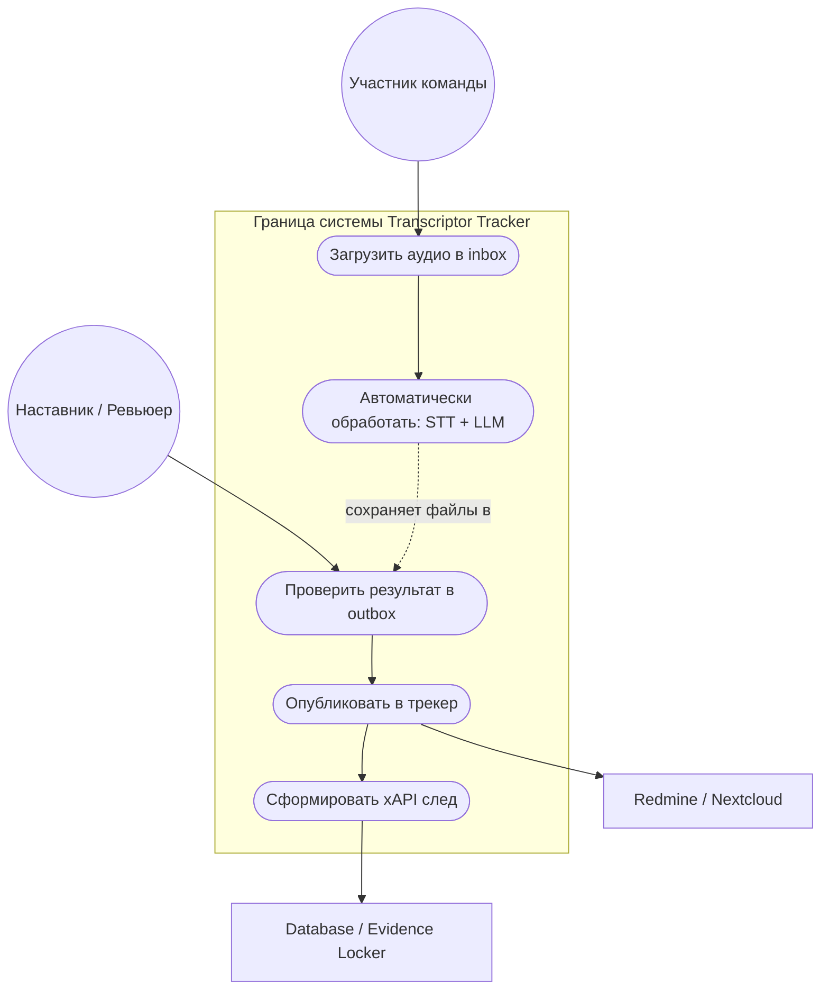
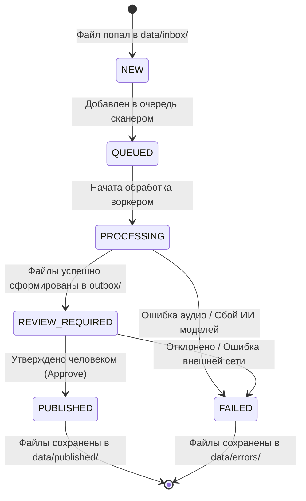
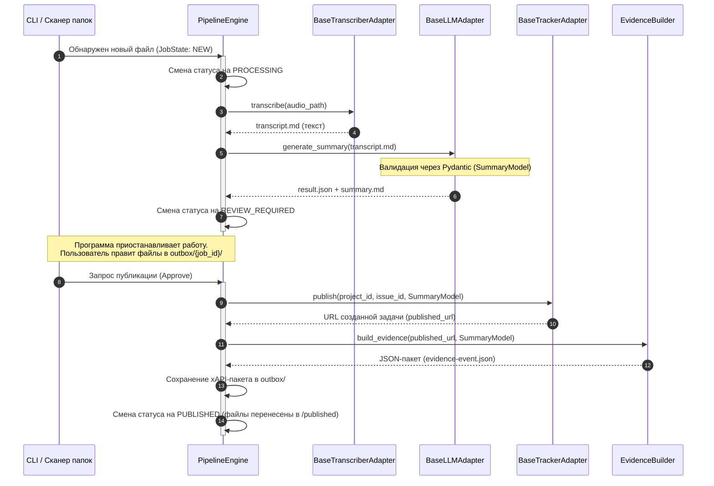

# Техническая спецификация модуля Transcriptor-Tracker

## 1. Общие сведения
Модуль Transcriptor-Tracker — интеграционный сервис, предназначенный для автоматической трансформации аудиозаписей рабочих встреч в структурированные текстовые артефакты (транскрипты, резюме), публикации их во внешние трекеры задач (Redmine/Nextcloud) после ручной проверки, а также генерации машинно-читаемых свидетельств в формате xAPI [1.1].

**Текущий статус:** Draft (MVP)  
**Режим разработки:** Совместная работа (2 разработчика), ветвление по FOSS-принципам, обязательное прохождение код-ревью (Pull Requests).

### 1.1. Сценарии использования (Use-Case Diagram)
Ниже представлена схема взаимодействия участников команды и внешних систем с разрабатываемым MVP-модулем [1.1]:



---

## 2. Архитектура и паттерны проектирования
Для обеспечения слабой связности компонентов, изоляции модулей при командной разработке и возможности автономного тестирования применяется паттерн Adapter (Адаптер) [1.1].

### 2.1. Основные абстракции
* **`BaseTranscriberAdapter`** — интерфейс для систем Speech-to-Text (преобразования речи в текст).
  * *Реализации:* `WhisperLocalAdapter` (локальный запуск), `MockTranscriberAdapter` (заглушка для тестов).
* **`BaseLLMAdapter`** — интерфейс для генерации резюме и анализа текста.
  * *Реализации:* `LocalLLMAdapter`, `MockLLMAdapter` (заглушка для тестов).
* **`BaseTrackerAdapter`** — интерфейс для работы с целевыми контурами публикации результатов.
  * *Реализации:* `RedmineAdapter`, `NextcloudAdapter`, `MockTrackerAdapter` (заглушка для локальной отладки).

### 2.2. Контракт интерфейса BaseTrackerAdapter
```python
from abc import ABC, abstractmethod
from models import SummaryModel

class BaseTrackerAdapter(ABC):
    @abstractmethod
    def publish(self, project_id: str, issue_id: str, summary: SummaryModel) -> str:
        """
        Публикует проверенное резюме во внешний трекер задач.
        
        Args:
            project_id (str): Идентификатор проекта во внешней системе.
            issue_id (str): Идентификатор задачи/тикета.
            summary (SummaryModel): Валидированная Pydantic-модель резюме.
            
        Returns:
            str: URL опубликованного артефакта во внешней системе.
        """
        pass
```

---

## 3. Топология файловой системы и пути
Модуль оперирует выделенной директорией для реализации хранения состояний файлов без привлечения тяжелых СУБД. Базовый путь задается переменной окружения в `.env` (например, `BASE_DATA_DIR=/app/data`).

### 3.1. Структура рабочих папок
```text
data/
├── inbox/           # Входные аудиофайлы (.wav, .mp3, .m4a) и файлы метаданных
├── processing/      # Временные файлы обрабатываемых задач (Job)
├── outbox/          # Сгенерированные артефакты, ожидающие ручной проверки
├── published/       # Результаты, успешно опубликованные в трекер
└── errors/          # Файлы, вызвавшие сбой или ошибку при обработке
```

### 3.2. Выходные артефакты (содержимое папки `outbox/{job_id}/`)
Для каждой сессии обработки создается изолированная директория, содержащая следующие файлы:
* `transcript.md` — полная текстовая расшифровка аудиозаписи.
* `summary.md` — человекочитаемое резюме встречи.
* `result.json` — структурированные данные (соответствует схеме `SummaryModel`).
* `evidence-event.json` — JSON-пакет xAPI-события (свидетельство работы) [1.1].
* `published-link.txt` — текстовый файл с URL-ссылкой на тикет в трекере задач (появляется после публикации).

---

## 4. Структуры данных (Pydantic Models)
Обмен данными внутри конвейера обработки жестко типизирован.

### 4.1. Модель резюме (SummaryModel)
```python
from pydantic import BaseModel
from typing import List, Dict, Optional

class ActionItem(BaseModel):
    task: str
    assignee: Optional[str] = None
    is_smart: bool  # Признак соответствия задачи критериям SMART

class SummaryModel(BaseModel):
    context: str
    decisions: List[str]
    open_questions: List[str]
    conflicts: List[str]
    next_actions: List[ActionItem]
```

### 4.2. Модель состояния задачи (JobState)
```python
from enum import Enum

class JobState(str, Enum):
    NEW = "new"                           # Обнаружен новый файл в inbox/
    QUEUED = "queued"                     # Задача поставлена в очередь обработки
    PROCESSING = "processing"             # Запущен процесс транскрибации/анализа
    REVIEW_REQUIRED = "review_required"   # Сгенерированные файлы ожидают проверки человеком
    PUBLISHED = "published"               # Результаты успешно отправлены во внешний трекер
    FAILED = "failed"                     # Произошел сбой на одном из этапов пайплайна
```

---

## 5. Интерфейсы взаимодействия (CLI и API)

### 5.1. Интерфейс командной строки (CLI)
Для явного ручного запуска обработки или публикации изменений используется интерфейс командной строки:

```bash
# Пример команды запуска конвейера обработки для файла
python -m transcriptor_tracker.cli process \
    --audio data/inbox/meeting_12.mp3 \
    --project-id "redmine-proj-42" \
    --issue-id "8492" \
    --output-dir data/outbox/ \
    --reviewer "fedor.ivanov" \
    --consent-confirmed true
```

### 5.2. Программный API (Управление и мониторинг)
Полноценный POST-запрос сквозного прохождения задачи (`POST /process`) запрещен ограничениями MVP-архитектуры во избежание блокировок сетевых потоков. Обработка очереди выполняется асинхронно.

* `POST /folders` — зарегистрировать локальный путь для сканирования.
* `GET /folders` — список зарегистрированных папок.
* `POST /folders/{id}/scan` — принудительно запустить сканирование папки на наличие файлов (переводит новые файлы из статуса `NEW` в `QUEUED`).
* `GET /jobs/{id}` — получить текущий статус `JobState` и ссылки на артефакты.

#### Механизм обработки очереди (QUEUED -> PROCESSING)
Перевод задач из состояния `QUEUED` в `PROCESSING` осуществляется встроенным планировщиком задач (например, `BackgroundTasks` в FastAPI или отдельным легковесным потоком-демоном внутри приложения), который опрашивает очередь с интервалом, заданным в конфигурационном файле, и последовательно запускает `PipelineEngine`. Это исключает необходимость развертывания Celery/Redis в рамках MVP.

---

## 6. Формат событий xAPI (Свидетельства)
Система генерирует машинно-читаемые события xAPI на этапе перевода задачи в статус `PUBLISHED` (после ручного подтверждения ревьюером) [1.1].

Пример сгенерированного файла `evidence-event.json`:
```json
{
  "actor": {
    "name": "Team Alpha / Reviewer: Fedor Ivanov",
    "mbox": "mailto:fedor.ivanov@edu.team"
  },
  "verb": {
    "id": "http://adlnet.gov/expapi/verbs/created",
    "display": {
      "ru-RU": "создал проверяемый артефакт обсуждения"
    }
  },
  "object": {
    "id": "https://redmine.edu.local/issues/8492#note-3",
    "definition": {
      "name": {
        "ru-RU": "Резюме стендапа и список следующих действий"
      },
      "type": "https://example.edu/xapi/activity-types/project-artifact"
    }
  },
  "context": {
    "contextActivities": {
      "parent": [
        {
          "id": "https://redmine.edu.local/projects/redmine-proj-42"
        }
      ]
    }
  },
  "result": {
    "success": true,
    "extensions": {
      "https://example.edu/xapi/extensions/source": "transcriptor-tracker-module",
      "https://example.edu/xapi/extensions/evidence-files": [
        "data/outbox/job_123/transcript.md"
      ],
      "https://example.edu/xapi/extensions/detected-patterns": [
        "smart-task-definition",
        "conflict-resolution",
        "human-reviewed"
      ],
      "https://example.edu/xapi/extensions/modifications-during-review": false
    }
  }
}
```

---

## 7. Жизненный цикл процесса (Диаграммы)

### 7.1. Диаграмма состояний (State Diagram)
Ниже представлены возможные переходы состояний задачи (`JobState`) в процессе жизненного цикла обработки аудиозаписи встречи:



### 7.2. Диаграмма последовательности (Sequence Diagram)
Схема прохождения сигналов и вызовов функций внутри компонентов конвейера при стандартном успешном сценарии:



---

## 8. Правила тестирования и CI/CD
Для соответствия принципам коллективной разработки (FOSSDEV) в проекте фиксируются жесткие требования к автоматическому контролю качества кода.

* **Изоляция сетевых вызовов:** Прямые внешние сетевые обращения к API-интерфейсам Redmine, Nextcloud или LLM-провайдеров в тестах полностью запрещены.
* **Изоляция тяжелых зависимостей:** В файле `tests/conftest.py` должны быть реализованы фикстуры, автоматически подменяющие реальные адаптеры на `MockTranscriberAdapter`, `MockLLMAdapter` и `MockTrackerAdapter`. Тесты не должны инициировать скачивание или локальный запуск весов моделей Whisper и локальных LLM.
* **Контроль покрытия кода (Code Coverage):**
  * Минимально допустимый порог покрытия кода тестами для слияния любой ветки в ветку `main` составляет **80%**.
  * Проверка осуществляется автоматически перед каждым слиянием PR с помощью утилиты `pytest-cov` через команду:
    ```bash
    pytest --cov=src --cov-fail-under=80
    ```
    Если уровень покрытия ниже указанного значения, сборка/слияние блокируется.